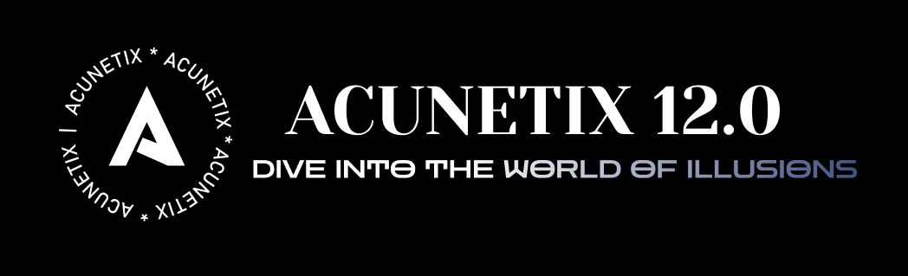
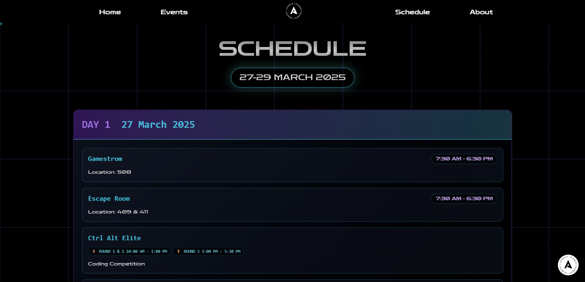
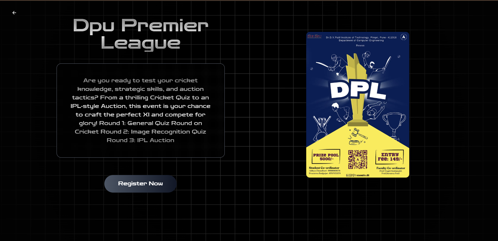
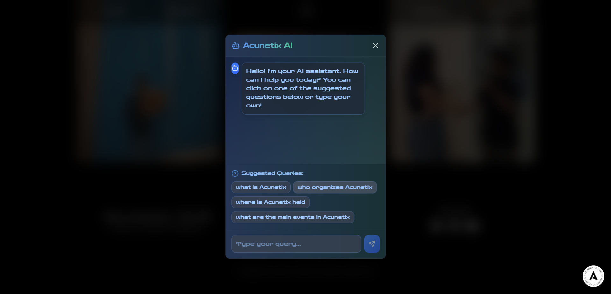

# 🚀 Acunetix 12.0– Tech Fest Website



[](https://acunetix12.tech)
[](https://reactjs.org)
[](https://vitejs.dev)
[](https://tailwindcss.com)

> **"Dive into the world of illusions"** - India's premier student-led tech festival featuring cutting-edge technology and immersive experiences.

## 🎯 Project Overview

**Acunetix 12.0** is a flagship event organized by ACES and CSI, offering a range of Tech & Non-Tech events. Participants take part in diverse competitions, showcasing their skills and earning recognition. With exciting prizes and a mix of solo and team events, it's a unique opportunity for students to shine and be part of an unforgettable experience.

### 🏆 Key Achievements
- **3000+** students used the platform during the tech fest
- **97% Mobile** and **100% Desktop** SEO scores via Google Search Console
- **Ranked #2** in Google Search with analytics monitored via Google Analytics
- **500+** AI chatbot responses for real-time assistance

## 📜 Table of Contents
- [✨ Features](#-features)
- [📸 Website Screenshots](#-website-screenshots)
- [🛠 Tech Stack](#-tech-stack)
- [🏆 Featured Events](#-featured-events)
- [🚀 Quick Start](#-quick-start)

---

## ✨ Features

### 🎨 **Modern Tech Stack & Performance**

- **React 19** with Vite 6.2 for lightning-fast development
- **Advanced Animations**: Framer Motion, GSAP, Locomotive Scroll
- **3D Graphics**: Three.js and WebGL for immersive experiences
- **AI Chatbot**: 500+ responses with natural language processing
- **Performance**: 97% Mobile and 100% Desktop SEO scores

### 🎯 **Key Technical Highlights**

- **Responsive Design**: Mobile-first approach with dark theme
- **SEO Optimized**: Comprehensive meta tags and structured data
- **Real-time Features**: Live countdown, dynamic content updates
- **Modern Architecture**: Component-based design with TypeScript support

---

## 📸 Website Screenshots

<div align="center">

### 🏠 **Main Pages**

<table style="background-color: #0D1117; border: 2px solid #30363D; border-radius: 12px; overflow: hidden; width: 100%;">
<thead style="background: linear-gradient(135deg, #1F2937, #374151); color: #F9FAFB;">
<tr>
<th style="padding: 16px; border-bottom: 1px solid #374151; font-weight: 600;">🏷️ Page</th>
<th style="padding: 16px; border-bottom: 1px solid #374151; font-weight: 600;">📱 Preview</th>
<th style="padding: 16px; border-bottom: 1px solid #374151; font-weight: 600;">📝 Description</th>
</tr>
</thead>
<tbody style="color: #E5E7EB;">
<tr style="border-bottom: 1px solid #21262D;">
<td style="padding: 16px; font-weight: 500; color: #58A6FF;"><strong>Home Page</strong></td>
<td style="padding: 16px;"></td>
<td style="padding: 16px;">Landing page with hero section and event overview</td>
</tr>
<tr style="border-bottom: 1px solid #21262D;">
<td style="padding: 16px; font-weight: 500; color: #58A6FF;"><strong>About Us</strong></td>
<td style="padding: 16px;"></td>
<td style="padding: 16px;">Information about ACES & CSI organizations</td>
</tr>
<tr>
<td style="padding: 16px; font-weight: 500; color: #58A6FF;"><strong>Schedule</strong></td>
<td style="padding: 16px;"></td>
<td style="padding: 16px;">Event timeline and important dates</td>
</tr>
</tbody>
</table>

### 🎮 **Event Pages**

<table style="background-color: #0D1117; border: 2px solid #30363D; border-radius: 12px; overflow: hidden; width: 100%;">
<thead style="background: linear-gradient(135deg, #1F2937, #374151); color: #F9FAFB;">
<tr>
<th style="padding: 16px; border-bottom: 1px solid #374151; font-weight: 600;">🎯 Section</th>
<th style="padding: 16px; border-bottom: 1px solid #374151; font-weight: 600;">📱 Preview</th>
<th style="padding: 16px; border-bottom: 1px solid #374151; font-weight: 600;">📝 Description</th>
</tr>
</thead>
<tbody style="color: #E5E7EB;">
<tr style="border-bottom: 1px solid #21262D;">
<td style="padding: 16px; font-weight: 500; color: #7C3AED;"><strong>Tech Events</strong></td>
<td style="padding: 16px;"></td>
<td style="padding: 16px;">Technical competitions and coding challenges</td>
</tr>
<tr>
<td style="padding: 16px; font-weight: 500; color: #7C3AED;"><strong>Non-Tech Events</strong></td>
<td style="padding: 16px;"></td>
<td style="padding: 16px;">Gaming, quiz, and entertainment events</td>
</tr>
</tbody>
</table>

### 📝 **Registration System**

<table style="background-color: #0D1117; border: 2px solid #30363D; border-radius: 12px; overflow: hidden; width: 100%;">
<thead style="background: linear-gradient(135deg, #1F2937, #374151); color: #F9FAFB;">
<tr>
<th style="padding: 16px; border-bottom: 1px solid #374151; font-weight: 600;">⚙️ Feature</th>
<th style="padding: 16px; border-bottom: 1px solid #374151; font-weight: 600;">📱 Preview</th>
<th style="padding: 16px; border-bottom: 1px solid #374151; font-weight: 600;">📝 Description</th>
</tr>
</thead>
<tbody style="color: #E5E7EB;">
<tr style="border-bottom: 1px solid #21262D;">
<td style="padding: 16px; font-weight: 500; color: #10B981;"><strong>Tech Registration</strong></td>
<td style="padding: 16px;"></td>
<td style="padding: 16px;">Registration form for technical events</td>
</tr>
<tr>
<td style="padding: 16px; font-weight: 500; color: #10B981;"><strong>Non-Tech Registration</strong></td>
<td style="padding: 16px;"></td>
<td style="padding: 16px;">Registration form for non-technical events</td>
</tr>
</tbody>
</table>

### 🤖 **AI Features**

<table style="background-color: #0D1117; border: 2px solid #30363D; border-radius: 12px; overflow: hidden; width: 100%;">
<thead style="background: linear-gradient(135deg, #1F2937, #374151); color: #F9FAFB;">
<tr>
<th style="padding: 16px; border-bottom: 1px solid #374151; font-weight: 600;">🔧 Feature</th>
<th style="padding: 16px; border-bottom: 1px solid #374151; font-weight: 600;">📱 Preview</th>
<th style="padding: 16px; border-bottom: 1px solid #374151; font-weight: 600;">📝 Description</th>
</tr>
</thead>
<tbody style="color: #E5E7EB;">
<tr>
<td style="padding: 16px; font-weight: 500; color: #F59E0B;"><strong>Chatbot</strong></td>
<td style="padding: 16px;"></td>
<td style="padding: 16px;">AI-powered chatbot with 500+ FAQs</td>
</tr>
</tbody>
</table>

</div>

---

## 🛠 Tech Stack


---

## 🏆 Featured Events

**10+ Technical Competitions | 4 Esports Tournaments | ₹50,000+ Prize Pool**

| 🎮 **Esports** | 💻 **Technical** | 🧠 **Quiz & Strategy** |
|----------------|------------------|-------------------------|
| Valorant (₹10K) | Ctrl-Alt-Elite (₹6K) | DPL Cricket (₹5K) |
| FIFA 23 (₹5K) | Bug Bounty (₹3K) | Brainiac Quiz (₹4K) |
| COD Mobile (₹7K) | Code of Lies (₹5K) | Treasure Trove (₹8K) |
| Free Fire (₹8K) | Build-a-thon (₹3K) | TimeScape (₹6K) |

---

## 🚀 Quick Start

```bash
# Clone the repository
$ git clone https://github.com/Tejas-Santosh-Nalawade/Acunetix-12.0.git

# Navigate to the project directory
$ cd Acunetix-12.0

# Install dependencies
$ npm install

# Start the development server
$ npm run dev

# Additional Scripts
$ npm run build     # Create a production build
$ npm run preview   # Preview the production build
$ npm run lint      # Check code quality
```

---

## 🏅 Key Metrics & Recognition

### **Technical Excellence**
- ⚡ **97% Mobile** and **100% Desktop** SEO Scores
- 📱 **3000+** Students Used the Platform
- 🎯 **Ranked #2** in Google Search

### **Event Impact**
- Built SPA with modern animation and optimized performance, used by **3000+ students** during the tech fest
- Deployed chatbot with **500+ FAQs**; enhanced UI with Framer Motion components
- Achieved **97% Mobile** and **100% Desktop** SEO scores via Google Search Console
- Ranked **#2 in Google Search** and monitored analytics via Google Analytics

---

<div align="center">

**⭐ Star this repository if you found it impressive! ⭐**

**Made with ❤️ by ACES & CSI Development Team**

[](https://github.com/Tejas-Santosh-Nalawade/Acunetix-12.0/stargazers)
[](https://github.com/Tejas-Santosh-Nalawade/Acunetix-12.0/network/members)

</div>
